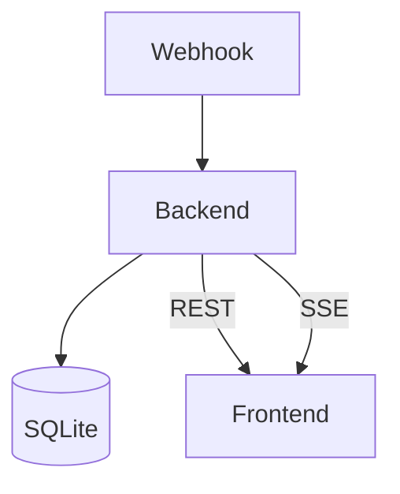

# Pocsag Web

Dies ist eine private Webanwendung zur Anzeige der Alarmliste von **Pocsag Südtirol**.

## Datenfluss



## Setup

### Docker

```bash
docker-compose up -d
```

### One-Click Installer

Für ein lokales Setup kann das Skript `install.sh` genutzt werden. Es richtet
alle benötigten Dateien ein, installiert Abhängigkeiten und startet die
Dienste. Das Skript erkennt dabei automatisch, ob `apt-get` oder `yum`
verfügbar ist und installiert Docker entsprechend:

```bash
./install.sh
```

### Lokal

1. `cd backend && npm install`
2. `cd frontend && npm install`
3. `.env` anlegen nach `.env.example`
4. Backend starten: `npm run dev`
5. Frontend starten: `npm run dev`

## .env Variablen

```
PORT=3000
JWT_SECRET=changeme
POCSAG_USER=<user>
POCSAG_PASS=<pass>
```

## Screenshots


