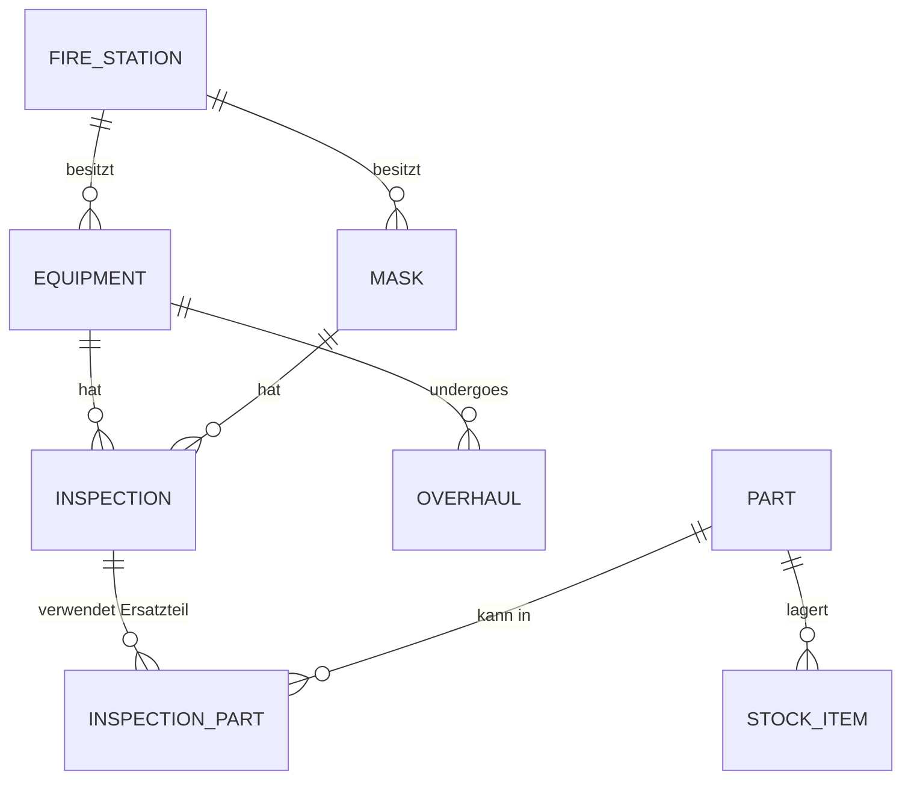

# Konzept für eine Verwaltungssoftware zur Atemschutzgeräte- & Maskenprüfung

*Version 0.1 – 18. Juli 2025*

---

## 1 Ziele & Rahmenbedingungen

| Aspekt | Beschreibung |
| --- | --- |
| **Ziel** | Digitale Komplettlösung zur Verwaltung, Prüfung und Instandhaltung von Atemschutzgeräten, Masken und Ersatzteilen für ca. 30 Feuerwehren. |
| **Einsatz** | Web-App (responsiv) + optionale Mobile-App (PWA) für Werkstatt & Lager. |
| **Nutzer** | • Administrator (System- & Stammdaten) • Prüftechniker/Werkstatt • Feuerwehr-Kontakt (Leserechte, Berichte) |
| **Technologien** | TypeScript / React + Tailwind, Node.js (API) mit Express/Fastify, PostgreSQL, Prisma ORM, Auth (JWT/OIDC). Code-Gen & Automation mit OpenAI Codex (KI Agent). |
| **Hosting** | Docker-Container auf Hetzner Cloud oder Azure; CI/CD via GitHub Actions. |

---

## 2 Hauptmodule & Funktionalität

1. **Feuerwehr-Stammdaten**
   • Kontakt- & Adresse
   • Kommandant oder Atemschutzwart der Feuerwehr.

2. **Geräte- & Maskenverwaltung**
   • Inventar (Seriennr., Typ, Hersteller, Modell, zugeordnete Feuerwehr).
   • Zustands-/Lebenszyklusstatus (aktiv, außer Betrieb, ausgemustert).
   • Grundüberholungs-Timer (alle 6 Jahre).

3. **Ersatzteilverwaltung**
   • Artikelstamm (Artikel-Nr., Bezeichnung, Hersteller, Haltbarkeit [Jahre]).
   • Lagerbestände (Mengen, Mindestbestand, Chargen/Verfallsdatum).
   • Bestellvorschläge & Jahresbedarf-Prognose.

4. **Prüfungsmanagement**
   • Terminierung (jährliche Prüfungen, Grundüberholungen).
   • Checkliste pro Gerät/Maske (DIN-Normen).
   • Erfassung ausgetauschter Teile & Arbeitsaufwand.

5. **Reporting & Formulare**
   • Automatischer Prüfbericht (PDF) pro Feuerwehr.
   • Inventarliste, Lebensdauer-Historie, Ersatzteilverbrauch.
   • Dashboard: Nächste fällige Prüfungen, Lagerwarnungen.

---

## 3 Datenmodell (vereinfacht)

*Weitere Attribute siehe Datenbank-Schema-Entwurf.*

---

## 4 Kern-Workflows

### 4.1 Jährliche Sammelprüfung

1. Techniker erstellt neue Prüfung im System
2. System erstellt **Prüfauftrag** mit Checklisten.
3. Techniker erledigt Prüfpunkte, erfasst Ersatzteile.
4. Bei Grundüberholung (>6 Jahre) keine Prüfung, muss extern gemacht werden
5. Abschluss → generierte **PDF-Berichte**

### 4.2 Ersatzteil-Forecast & Bestellung

1. Cron-Job berechnet Bedarf für nächstes Jahr (Haltbarkeitsfristen).
2. Vergleich mit Lagerbestand → **Bestellliste**.

---

## 5 Benutzeroberfläche (Skizze)

* **Sidebar-Navigation**: Feuerwehren, Geräte, Masken, Ersatzteile, Prüfungen, Reports.
* **Listen** mit Filter, Suche, Mehrfach-Aktionen.
* **Detailseiten** mit Tabs (Historie, Dokumente).
* **Wizard** für Sammelprüfung.
* **Dashboard-Karten**: rote / gelbe Warnungen.

---

## 6 KI-Agent Codex-Einsatz

| Phase | Nutzung Codex |
| -------------------- | --------------------------------------------------------------- |
| **Code-Generierung** | Scaffold für React-Komponenten, Express-Routes, Prisma-Modelle. |
| **Tests** | Unit- & E2E-Tests (Jest, Playwright). |
| **Migrations** | SQL-Migrationen & Seed-Daten. |
| **Dokumentation** | Automatisches Genieren von API-Docs (OpenAPI 3). |

---

## 7 Sicherheit & Compliance

* DSGVO-konforme Datenverarbeitung.
* Verschlüsselung (TLS 1.3, at-rest AES-256).
* Rollen- & Rechte-Management (RBAC).

---

## 8 Skalierung & Wartung

* Micro-Service-Ready Architektur (falls Wachstum >100 Feuerwehren).
* Observability: Grafana + Prometheus.

---

## 9 Roadmap (MVP → v1.0)

| Quartal | Meilenstein |
| ------- | -------------------------------------------------------- |
| Q3 2025 | MVP Backend (Prüfungs-API) + Basis-Frontend (Inventar) |
| Q4 2025 | Ersatzteil-Modul, PDF-Berichte, Auth + Rollen |
| Q1 2026 | Prognose-Algorithmus, Mobil-PWA, Benachrichtigungen |
| Q2 2026 | Multi-Mandant-Dashboard, ERP-Integration, Audit-Features |

---

## 10 Nächste Schritte (detailliert)

| KW / Zeitraum 2025 | Aufgabe | Verantwortlich | Ergebnis |
| -------------------- | ----------------------------------------------------------------- | --------------------------- | ------------------------------------ |
| KW 30 (22.–28. Juli) | Konzept-Review & Feedbackrunde mit 3 Pilot-Feuerwehren | Product Owner + Stakeholder | Abgenommene Anforderungsliste (v0.2) |
| KW 31 | Detail-User-Stories & Akzeptanzkriterien in Jira anlegen | Product Owner, Entwickler | Priorisiertes Product Backlog |
| KW 32 | UI-Mockups (Figma) und Navigationsfluss erstellen | UX-Designer | Click-Dummy v1 |
| KW 33 | Finales Datenbankschema & Migrationsskripte | Backend-Lead | Prisma-Schema v1 + SQL-Migration |
| KW 34 | Dev-Umgebung & CI/CD-Pipeline (GitHub Actions + Docker) aufsetzen | DevOps | Pipeline läuft grün |
| KW 35–37 | Code-Skeleton via Codex: Auth, Stammdaten, Inventar-API | Full-Stack-Team | MVP-Backend Repo |
| KW 38 | End-to-End-Tests (v0.1) & QA-Review | QA-Engineer | Testbericht & Abnahmeprotokoll |
| KW 39 | MVP-Demo bei Pilot-Feuerwehren | Gesamtes Team | Feedback & Go/No-Go für Rollout |

**Parallel-Tasks**

* Sicherheits-Konzept & DSGVO-Doku (KW 32–34)
* Lieferanten-Schnittstelle (CSV/REST) für Ersatzteilbestellungen entwerfen (KW 35–36)
* Wartungshandbuch & Onboarding-Material (KW 38–40)

> Nach positiver MVP-Demo beginnt Phase v0.9 (Feature-Freeze, Bug-Fixing) mit Ziel Release-v1.0 im Q4 2025.
